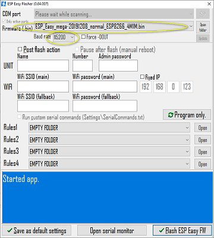

# ESPEasy on NodeMcu v2 /v3

## Install USB to serial driver

- NodeMCU v2 (CP2102) 
  - [Windows](https://www.silabs.com/products/development-tools/software/usb-to-uart-bridge-vcp)
  - Mac tdd
  - Linux tdd
- NodeMCU v3 (CP340)
  - [Windows](http://www.wch.cn/download/CH341SER_ZIP.html)
  - [Mac](http://www.wch.cn/download/CH341SER_MAC_ZIP.html)
  - [Linux](https://github.com/juliagoda/CH341SER)

## Download ESPEasy software & flasher

Head to the [release page](https://github.com/letscontrolit/ESPEasy/releases) and download the latest release zip file.

### Windows
Unpack the file and place the `ESP.Easy.Flasher.exe` in an directory e.g. `C:\ESPEasy`.  After starting the first time
I'll create a couple of folder. After they are create you can close the application again.

Now place the firmware to flash ( e.g.`ESP_Easy_mega-*normal_ESP8266_4M1M.bin`) in the newly created `bin` directory.

## Connect the NodeMCU

Now it's time to connect the NodeMCU to your PC using a microUSB cable.

## Flash software

Please start the `ESP.Easy.Flasher.exe` again. You should now be able to selected the firmware using the 
`Firmware`-Dropdown. Leave the Baud rate at 115200

## Wiring

Now you can [wire](WIRERING_MHZ19B.md) the MHZ 19B Sensor

## Booting the NodeMcu

You can now boot the NodeMcu. You should now see a new WIFI-accesspoint called _ESP_Easy_0_.
Enter the password _configesp_ to connect. If you're not automatically taken to the log-in page, browse to 192.168.4.1.

Search for you routers WiFi and connect.