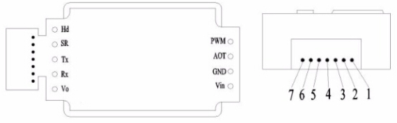

# Wiring the MH Z19B Infrarot CO2 Sensor

## Schematics pins & cable

The MH Z19B Infrarot is available in 3 different styles.

 - Self solder the pins on
 - Soldered pins
 - Cable
 
 
I personally like to buy the cable version and remove the plug on the on side which should be connected to the 
NodeMCU and crimp dupont female header connectors on, so you can directly connect it to the NodeMcu.
 
### Pin schematics
 
 
#### Pin out
Pin | Definition
----|-----------
Vin | Vin
GND | GND
Vo  | Analog output(0.4～2 V)or (0~2.5V)
PWM | PWM
HD  | HD(zero calibration，low level lasting for over 7s under low level is effective)
Rx  | UART(RXD)TTL Level data input
Tx  | UART(TXD)TTL Level data output

#### Cable out
Pin | Definition
----|-----------
1 | Analog output(0.4～2 V)or (0~2.5V)
2 | - (HD/PWM?)
3 | GND
4 | Vin
5 | UART(RXD)TTL Level data input
6 | UART(TXD)TTL Level data output
7 | - (HD/PWM?)

[More information @ winsen-sensor.com](https://www.winsen-sensor.com/d/files/infrared-gas-sensor/mh-z19b-co2-ver1_0.pdf)

## Connect to NodeMCU

You can now connect the MH Z19B with the NodeMcu.

Use the following settings:

MH Z19B Pin | NodeMCU Pin
------------|------------
Vin         | VU
GND         | GND
UART (RXD)  | D6
UART (TXD)   | D7

See [NodeMcuV3 pin layout](images/NodeMcuV3.jpg)
